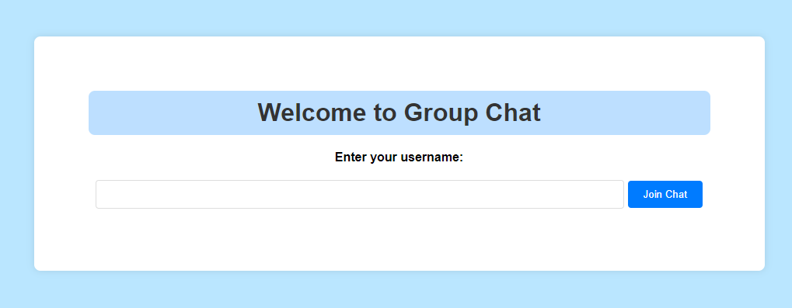
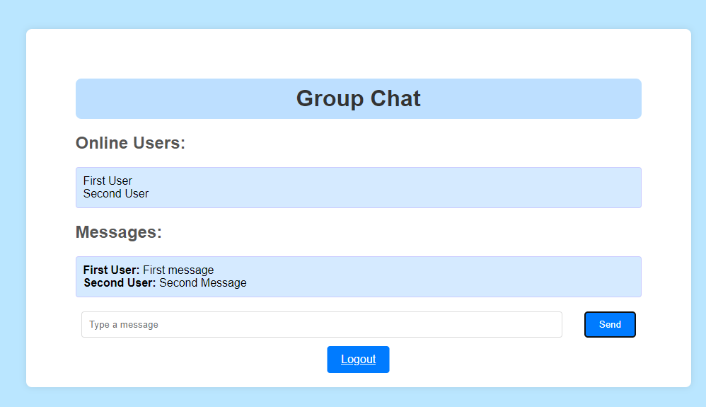

# Group Chat App

Group Chat App is a simple web application for real-time group messaging. 
It allows users to log in, send messages, and view messages from other users in real-time.

## Features

- **User Authentication**: Users can log in with their username.
- **Real-time Messaging**: Messages are sent and received in real-time using WebSocket technology.
- **Persistent Storage**: Chat messages are stored in H2 database.

## Technologies Used

- **Spring Boot**: Backend framework for Java web applications.
- **Spring Data JPA**: For interacting with the database.
- **Spring WebSockets**: For real-time messaging.
- **Hibernate**: Object-relational mapping library.
- **H2 Database**: In-memory database for development.
- **JavaScript**: For client-side interactions.
- **JUnit**: Testing framework for Java.
- **Mockito**: Mocking framework for unit tests.

## Getting Started

1. Clone the repository: `git clone <repository-url>`
2. Navigate to the project directory: `cd group-chat-app`
3. Build the project: `mvn clean install`
4. Deploy the WAR file to a servlet container like Apache Tomcat.
5. Start Tomcat server and access the application.

## Configuration

- The application properties can be found in `src/main/resources/application.properties` with profiles.
- Customize database settings, server port, and other configurations as needed.

## Screenshots 

